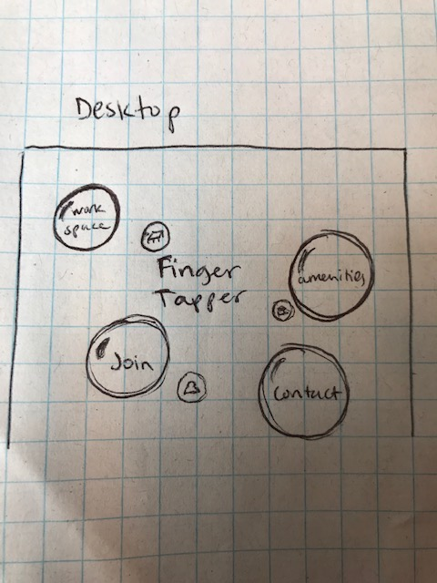
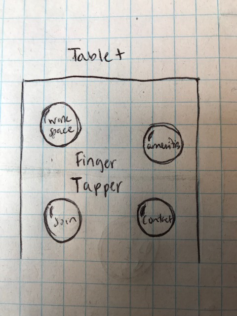
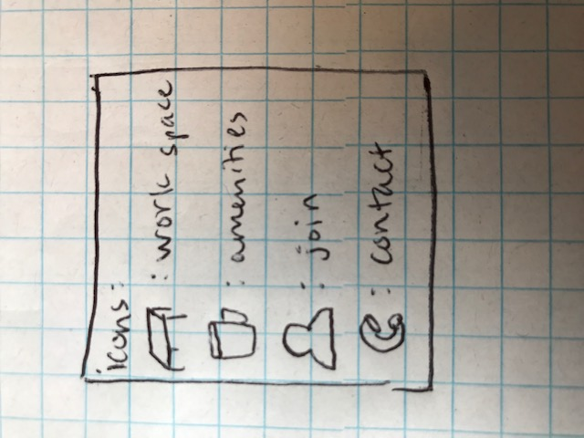
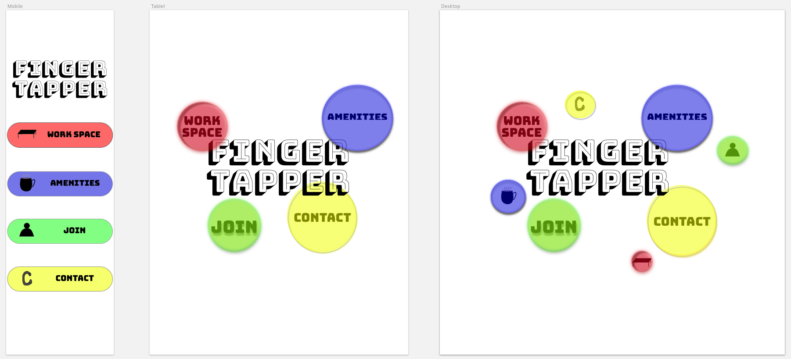
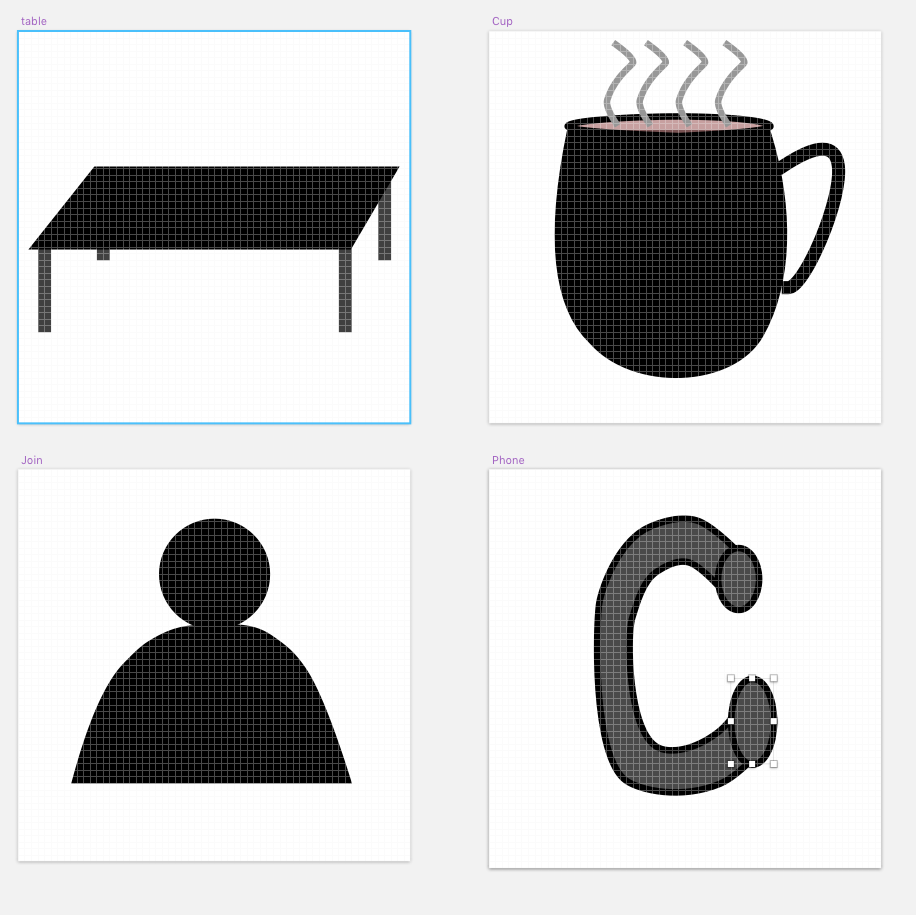
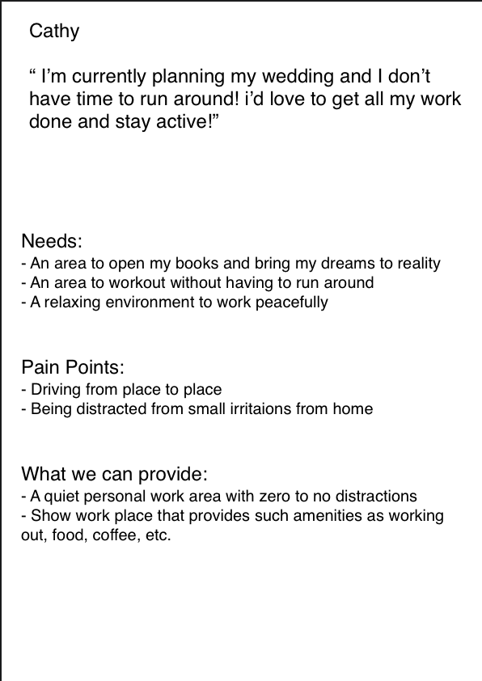
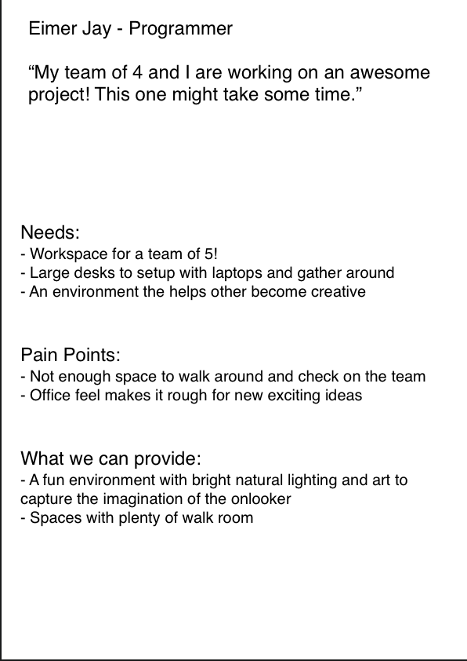

# _Finger Tapper_ #

#### _Finger Tapper provides work spaces for anyone and everyone who needs to step out of the house or office and work in an environment that will allow them to focus solely on work. Finger Tapper provides all types of tools and tables to get your work done!_

This website will show the user what type of space is available and what tools are provided by Finger Tapper. Users will also be able to contact Finger Tapper, join and reserve space. A list of amenities and types of work areas have a path site so users can views and see what's available.

##### By _Maly Phongsavanh_

## Sketches of Landing Pages

Desktop View | Tablet View | Mobile View | Icons |
--------------- | ------------- | ------------- | ---------------
 |  |  | 

Landing Page | Icons |
--------------- | ------------- |
 | 

## Personas

Cathy - Bride | Eimer - Tech |
------------- | ------------- |
 | 

## Support and contact details

If there are any _questions_ or would like to contribute to the code, please feel free to email

_[Maly Phongsavanh](mailto:phongsavanh619@icloud.com)_

## Technologies Used

* ATOM -text editor-
* SKETCH (mac only)
* HTML
* CSS
* SASS

### License
This software is licensed under the _MIT license_

Copyright (c) 2019 _Maly Phongsavanh_
